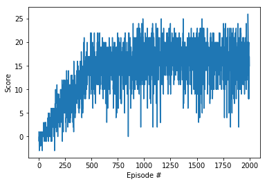

# DLRND Project 1 Navigation
Project Report

### Learning Algo

The algorithm used is the Deep Q-Learning Algorithm (https://storage.googleapis.com/deepmind-media/dqn/DQNNaturePaper.pdf). The implementation was taken directly from deep-reinforcement-learning/tree/master/dqn/solution without modification.

DQN samples the environment by acting and receiving a reward which it stores in a replay buffer. Every 4 samples, the network is trained on 32 random samples from the replay buffer.

The Q neural network is a 2-layer fully-connected network with 64 units per layer. Two of these networks are used in order to have a target network and a learning network.

The hyper-parameters are listed below:

```python

BUFFER_SIZE = int(1e5)  # replay buffer size
BATCH_SIZE = 64         # minibatch size
GAMMA = 0.99            # discount factor
TAU = 1e-3              # for soft update of target parameters
LR = 5e-4               # learning rate
```

### Plot of rewards
By episode 500, the agent was sufficiently trained to meet specification.



### Future Work
In terms of future work, some of the other flavours of DQN networks could be experimented with, such as Double DQN, prioritized experience replay or dueling DQN. To me, a prioritized replay seems very interesting as randomly sampling experience makes less sense than sampling in a more purposeful manner.
