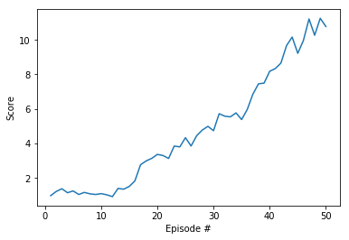
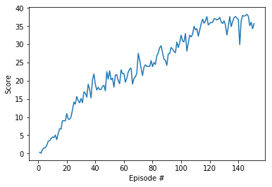

# DRLND Project 2 Reacher
Project Report

### Learning Algo

The algorithm used is the Deep Deterministic Policy Gradient Algorithm (https://arxiv.org/pdf/1509.02971.pdf). The implementation was based on ddpg-pendulum code from the Udacity DRLND repository.

Although there are 20 agents in the environment, there is only 1 DDPG agent. Each time step, 1 experience from each agent is added to the replay buffer and then the agent learns from the batch size number of samples.

The actor and critic networks are 3-layer fully-connected network with 400, 300, and 300 units per layer, respectively. Batch normalization was implemented but not used. Similar to DQN, there is a target network and learning network for each of the actor and critic.

The hyper-parameters are listed below:

```python

BUFFER_SIZE = int(1e6)# replay buffer size
BATCH_SIZE = 128      # minibatch size
GAMMA = 0.99          # discount factor
TAU = 1e-3*10          # for soft update of target parameters
LR_ACTOR = 1e-4       # learning rate of the actor
LR_CRITIC = 1e-3      # learning rate of the critic
WEIGHT_DECAY = 0      # L2 weight decay
THETA = 0.15*5        # OUNoise Theta
```

The hyper-parameters are the same as those used in the DDPG paper linked to above except for the batch size which is the same as the pendulum example. Using the Udacity workspace was convenient except that the workspace would go into an idle state after about 90 minutes. To meet specification before the workspace became idle was an additional goal (self-imposed). With the default hyper-parameters, the agent was able to achieve an average reward of 2.45 after 50 episodes. In order to learn quickly enough to meet specification before the workspace went idle, several modifications to DDPG were experimented with.

The most helpful hyper-parameter was the OU noise theta value. Increasing theta by a factor of 5 allowed the network to train much more quickly. The original OU noise theta value from the DDPG paper (0.15) resulted in slow learning. After 50 episodes, the average reward was less than 2.5. With 3 times the the original, after 50 episodes the average reward was 3.32. With 5 times the original, after 50 episodes the average reward was 4.73 (plot shown below).



Using a deeper 3-layer network was also experimented with. After 50 episodes, with 3 layers, the average reward was 7.87 compared to 4.73 with a 2-layer network. In order for the network to train, the hyper-parameter TAU was increased by a factor of 10. With the original value (1e-3), the deeper 3-layer network wasn't able exceed a score of 0.02 after 30 episodes. The 3-layer network was able to meet specification after 151 episodes, taking 62 minutes to train.

Batch normalization was implemented as the DDPG paper refers to it, but there was no batch normalization layer in the reference code. Ultimately, the algorithm was able to meet specification without using a batch normalization layer.

### Plot of rewards
By episode 151, the agent was sufficiently trained to meet specification.



### Future Work
Training robotic arms in the real world would be a logical next step and a very interesting challenge. A lot of work would have to be made to the current algorithm to achieve this. Specifically, using a different algorithm like D4PG or A3C would make sense as they are asynchronous.
