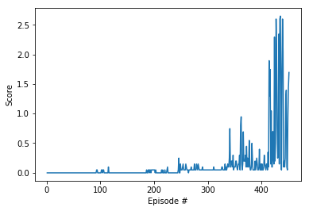

# DRLND Project 3 Tennis
Project Report

### Learning Algo

The algorithm used is the Deep Deterministic Policy Gradient Algorithm (https://arxiv.org/pdf/1509.02971.pdf). The implementation was based on ddpg-pendulum code from the Udacity DRLND repository.

Although there are 2 agents in the environment, there is only 1 DDPG agent. Each time step, 1 experience from each agent is added to the replay buffer and then the agent learns from the batch size number of samples.

The actor and critic networks are 3-layer fully-connected network with 400, 300, and 300 units per layer, respectively. Batch normalization was implemented but not used. Similar to DQN, there is a target network and learning network for each of the actor and critic.

The hyper-parameters are listed below:

```python

BUFFER_SIZE = int(1e6)# replay buffer size
BATCH_SIZE = 128      # minibatch size
GAMMA = 0.99          # discount factor
TAU = 1e-3*10          # for soft update of target parameters
LR_ACTOR = 1e-4       # learning rate of the actor
LR_CRITIC = 1e-3      # learning rate of the critic
WEIGHT_DECAY = 0      # L2 weight decay
THETA = 0.15*5        # OUNoise Theta
```

The hyper-parameters are the same as those used in the DDPG paper linked to above except for the batch size which is the same as the pendulum example.

The project was able to be solved using the exact same network and hyper-parameters from the previous project. The implementation uses the mean reward from both agents instead of the maximum which is clearly mathematically more challenging and sufficient to solve the maximum problem as well.

Batch normalization was implemented as the DDPG paper refers to it, but there was no batch normalization layer in the reference code. Ultimately, the algorithm was able to meet specification without using a batch normalization layer.

### Plot of rewards
By episode 451, the agent was sufficiently trained to meet specification. The training only took 30 minutes on a 2015 Macbook 12".



### Future Work
I think a more interesting approach would be to train multiple agents without sharing networks or experiences. The project as it is currently isn't really different from the p2 project. Both have multiple agents — it just happens that in p3 the agents are playing against each other.
